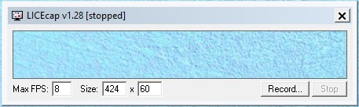
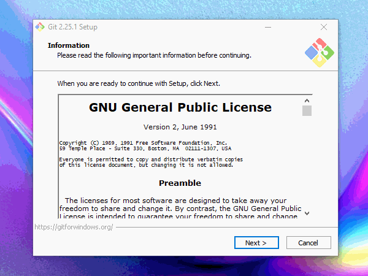
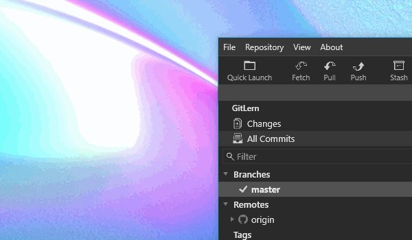
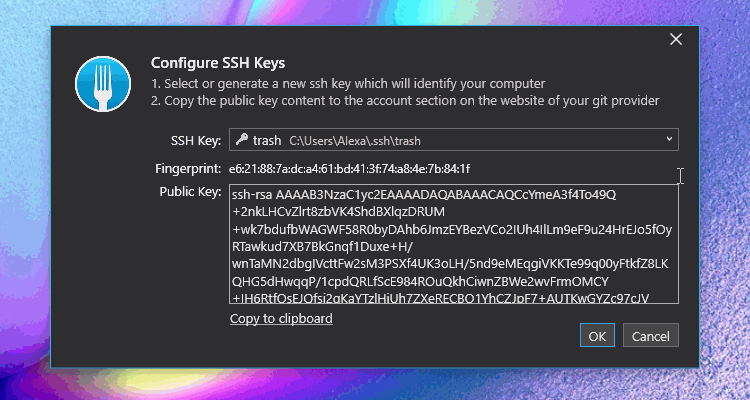

# Git

## Doku Markdown

**VISUAL STUDIO CODE PLUGINS**

- docs-markdown 0.2.43 (last old standart Image) from Microsoft
- Markdown PDF from yzane

**GIF TOOL**


Is a nice simple tool for doku with gifs.

[download licecap](http://cockos.com/licecap/)



**DOCS_MARKDOWN**

> [!CAUTION]
> You need version 0.2.43

This is the normal way to Markdown an image.
```markdown

```


## Git install



[download git](https://git-scm.com/download/win)

### Global Git Settings(Einstellung in Terminal)

Wechselt man den Editor/ Falls man beim installieren den falschen Editor auswählt(Noobs nutzen Visual Studio Code)
```bash
git config --global core.editor "code --wait"
```

Zeigt man sich die Config Datei dazu an
```bash
git config --global -e
```

Verändert man den User Name
```bash
git config --global user.name "Alexa"
```

Verändert man die User Email
```bash
git config --global user.email "a.rupp1992@gmail.com"
```

---

### Git Cheatsheet
Man kann git als server local hosten ohne Arbeitsverzeichnis (WorkingTree).

```bash
git init --bare name.git
```

normales Git initalisieren

```bash
git init name.git
```

GIT CLON

```bash
git clone ssh://username@192.168.188.36:/volume1/SERVER/GIT/name.git
```
Passwort Eingabe oder SSH Key

**Commit**

```bash
git commit -m 'Kommentar'
```

Wen es mal nicht läuft, nimm ein --help
```bash
git --help
```
___

**Fetch**
```bash
git fetch
```
**Push**
```bash
git push
```

**Pull**
```bash
git pull
```
____

git Status von letzten Commit

```bash
git status
```

Stage files

```bash
git add file.txt file.jpg
```

für alle Datein
```bash
git add .
```

---

**LOG**

```bash
git log --oneline
```
* Durch oneline wird das ganz gekürzt auf den wesentliche Inhalt.
* Option -p und --stat, um eine Übersicht darüber zu erhalten, was in jedem Commit enthalten ist
* --pretty und --oneline, um die Historie, zusammen mit einigen einfachen Datums- und Autoren-Filteroptionen, übersichtlicher wiederzugeben.
* --decorate, um leichter zu verdeutlichen, wo unser Branch-Pointer sich gerade befindet
* --graph Option, um zu sehen, wie die unterschiedlichen Verläufe aussehen

---

You can use git aliases, e.g.

```bash
git config --global alias.add-commit '!git add -A && git commit'
```
and use it with

```bash
git add-commit -m 'My commit message'
```

**Sehr gute Hilfe für Notfall**

[https://ohshitgit.com/de](https://ohshitgit.com/de)

---

## Git Client (Fork)


[download git-fork](https://git-fork.com/)


### SSH

Find SSH key generator function in fork



line SSH Key: drop down: generate SSH
    
new window open: enter data and press generate

> [!CAUTION]
> displayed path is location to find bot private and public SSH-Key locally when needed


